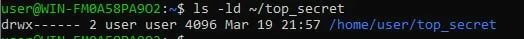
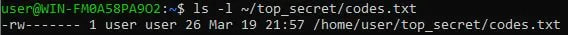
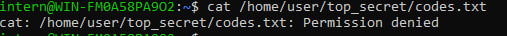
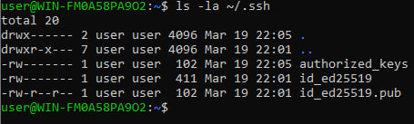
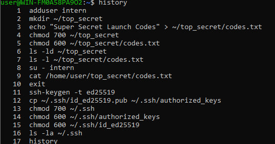

# Домашнее задание №2: «Сейф»

## 1. Права на папку top_secret

## 2. Права на файл codes.txt

## 3. Попытка доступа от имени intern (Permission denied)

## 4. Права на папку .ssh и ключи

## 5. История команд (history)

